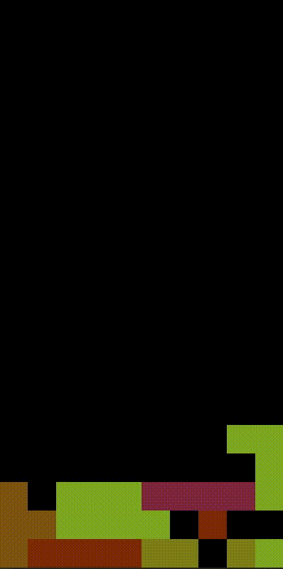

# Selfplaying Tetris

A tetris backported from Rust to C. Using basic genetic algorithm to fine tune the decision making function called bot.



## Build & Use

Can be bult with a simple `make` command. To use it with gui add `-gui` parameter like
```
./Tetris -gui
```
